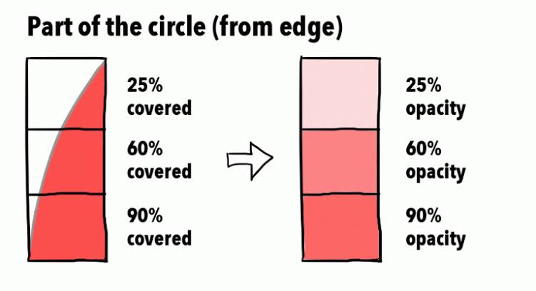

# 01 — Bresenham 画线（1962）

## 0. 背景知识：一块内存

你在 KMS 里做过的事情，抽象掉细节之后是这样一条链：

```
  DRM_IOCTL_MODE_CREATE_DUMB   →  拿到一块显存
  DRM_IOCTL_MODE_MAP_DUMB      →  mmap 到进程地址空间，得到 uint8_t*
  drmModeAddFB2                →  告诉内核"这块内存是一张图，宽高格式是这样"
  drmModeAtomicCommit          →  把它挂到 CRTC 上
  vblank                       →  显示器扫出这块内存的内容
```

这条链解决的是 "内存怎么变成光"。KMS 从头到尾没有关心过一件事：那块内存里到底应该是什么数字。

图形学就是那另一半。这个仓库里的 lesson 全部只做一件事：往那块内存里填数字。填得对，屏幕上就是一个球、一堵砖墙、一个康奈尔盒。


### 那块内存的结构

对我们来说它就是一个二维数组，但**不能**当成 `uint8_t data[height][width * 4]` 来算地址。三个必须记住的量：

| 量 | 含义 |
| --- | --- |
| `width` / `height` | 图像的像素宽高 |
| **`stride`** | **相邻两行在内存里差多少字节** |
| 像素格式 | 一个像素占几字节、字节怎么排 |

`stride` 是这里唯一反直觉的东西。你会想当然地认为 `stride == width * 4`，因为一个像素 4 字节。**在真硬件上通常不是。** 

显示控制器要求每行起始地址按 64 / 128 / 256 字节对齐（有的还要按 tile 对齐），内核分配 dumb buffer 时会把每行 padding 到对齐边界。1920 宽 × 4 字节 = 7680，恰好对齐，所以看不出来；但 1366 宽 × 4 = 5464，会被 padding 到 5504 或更多。

所以定位一个像素永远是：

```c++
uint8_t* p = base_ptr + y * stride + x * 4;   // 不是 y * width * 4
```


### 字节序

DRM 的 `XRGB8888` 在小端机器上，内存里的四个字节顺序是 **B, G, R, X**，不是 X, R, G, B。名字是按 32 位整数的高低位写的，内存是按字节序排的，两者反过来。

`mr::Pixel` 的字段顺序就是内存顺序：

```c++
struct Pixel {
    uint8_t b, g, r, x;
};
```

**验证方法**：整屏填 `rgb(255, 0, 0)`，屏幕应该是红的。如果是蓝的，就是搞反了。这个错误的症状是"配色有点怪"而不是"崩了"，所以特别能藏。


### 现在，把一个像素涂红

```c++
surface.put(100, 50, mr::rgb(255, 0, 0));
```

这就是这一课的全部输出手段。**剩下的问题只有一个：涂哪些像素。**


## 1. 问题：连续的线，离散的格子

数学里的线段是这样的：

```
  P(t) = A + t·(B − A),   t ∈ [0, 1]
```

它有无穷多个点，每个点的坐标是实数，线本身没有宽度。

屏幕不是这样的。屏幕是一张有限的方格纸，每个格子只能有一个颜色。你没法把一个格子涂"半红"，也没法在两个格子中间涂东西。

```
    数学的线                        屏幕能表达的
                                    ┌─┬─┬─┬─┬─┬─┬─┐
         ╱                          │ │ │ │ │ │█│█│
        ╱                           ├─┼─┼─┼─┼─┼─┼─┤
       ╱                            │ │ │ │█│█│ │ │
      ╱                             ├─┼─┼─┼─┼─┼─┼─┤
     ╱                              │ │█│█│ │ │ │ │
                                    └─┴─┴─┴─┴─┴─┴─┘
```

把一个连续的几何图形变成一组格子，这个过程叫 **光栅化（rasterization）**。

> 光栅化是将几何阶段输出的连续矢量图元（如投影到屏幕空间后的三角形、线段）转换为屏幕像素网格上离散片元（Fragment）的过程。

"raster" 原意是显像管的扫描光栅，也就是那一行行的格子。这个词在后面每一课都会出现：三角形光栅化、扫描线光栅化。这里是它最简单的形态。

于是这一课的问题精确地是：给定两个整数坐标的端点 A、B，选出一串像素，使它们"看起来像"从 A 到 B 的线段。


### 我们想要的输出长什么样

- **每一步只走到 8 邻域内的格子**（上下左右 + 四个斜角）。走两格就断了。
- **不能重复**。同一个格子涂两次是浪费，而且会在半透明混合时出错（后面的课）。
- **两个端点必须被涂上**，而且是这串像素的第一个和最后一个。
- **像素总数正好 `max(|Δx|, |Δy|) + 1`**。想一下为什么：走得快的那个轴每一步都必须前进一格（否则线会在那个方向断开），所以步数由它决定。

这四条后面就是我们的测试。


## 2. 第一次尝试：直接算 y

最直接的写法，任何人都能想出来。假设线偏水平（`|Δx| ≥ |Δy|`），那就沿 x 每次走一格，算出对应的 y，四舍五入：

```c++
// 朴素版本。正确，但我们不会用它。
float k = float(y1 - y0) / float(x1 - x0);   // 斜率
for (int x = x0; x <= x1; ++x) {
    int y = int(std::lround(y0 + k * (x - x0)));
    put(x, y);	// 点亮坐标点
}
```

这是对的。选出来的像素就是每一列里离直线最近的那个。如果只是想让屏幕上出现一条线，到这里就可以收工了。

但它有三个问题，每一个都值得单独说，因为它们在后面的课里会以别的形式反复出现。


### 问题一：每个像素一次乘法 + 一次浮点转整数

`m * (x - x0)` 是浮点乘法，`lround` 是浮点转整数（在很多架构上要走一条专门的转换指令，还可能触发流水线停顿）。而 `m` 本身要一次浮点除法。

**1962 年的语境**：Jack Bresenham 当时在 IBM 圣何塞，给 IBM 1401 接的 Calcomp 绘图仪写控制程序。那台机器**没有浮点单元**，浮点全靠软件模拟，一次浮点除法要几百个指令周期。逐像素做这个，等于不能用。

**今天的语境**：你可能觉得现在无所谓了。部分对，部分不对。现代 CPU 上一次 32 位整数加法约 1 周期、浮点乘加约 4 周期、浮点除法 10~20 周期且不能流水。

但更重要的是：本项目后面每一课的内层循环都在跑几百万次，到路径追踪那一课是每帧几亿次。"每像素省掉一次除法"这个思路本身比省下的那点周期重要得多


### 问题二：改成增量之后会累积误差

聪明一点的写法是不要每次重算，而是累加：

```c++
float y = y0;
for (int x = x0; x <= x1; ++x) {
    put(x, int(std::lround(y)));
    y += k;                    // 增量！省掉了乘法
}
```

省掉了乘法，但引入了新问题：`k` 是二进制浮点数，一般**不能精确表示**（比如 1/3）。每加一次，误差累积一点。画一条 4000 像素长的线，末端可能已经偏了。而且这个偏差和线的长度有关，短线看不出来，长线才出问题 。

Bresenham 算法的输出**没有这个问题**。它是精确的，不是近似的。这一点下一节会看得很清楚。


### 问题三：只对一半的方向成立

上面的循环沿 x 走。如果线接近垂直（`|Δy| > |Δx|`），沿 x 走会漏掉一大堆行，画出来是一串断开的点。得反过来沿 y 走，另写一份代码。

再算上四个方向的正负号，一共八种情况。**"某一种情况写错了"是这个算法最经典的 bug 形态** —— 七个方向都对，第八个差一格，而且只在某些斜率下出现。


## 3. Bresenham 的想法：别算 y，只问"要不要抬一格"

关键的 insight 是一句话：

> **你根本不需要知道 y 是多少。你只需要知道，走一步 x 之后，该不该把 y 抬一格。**

这是个是/否的问题。是/否的问题可以用一个累加器和一次比较来回答，而累加器可以是整数。

### 先把范围缩到最简单的情况

只看第一卦限的浅斜率：`Δx > 0`，`Δy ≥ 0`，`Δx ≥ Δy`（斜率在 0 到 1 之间，线偏水平且往右下走）。在这个范围里：

- x 每一步**必然** +1（否则线在 x 方向会断）
- y 每一步要么 +0，要么 +1

所以整个算法就是一个二选一的序列。画一条 `Δx = 10, Δy = 3` 的线，就是要在 10 步里选出哪 3 步抬 y。


### 决策变量

设当前已经画到了某个像素，记 **E = (这个像素的 y) − (真实直线在这个 x 处的 y)**。E 是"我画的点比真线高多少"，单位是像素，是个实数。

我们希望永远选**离真线最近**的那个像素，也就是希望 `|E| ≤ 1/2` 一直成立。

走一步 x 会发生什么：

- x 前进一格，真直线的 y 增加 `Δy/Δx`（斜率），我画的像素 y 不变 → `E` 减少 `Δy/Δx`
- 如果减完之后 `E <= −1/2`（我画低了，超过半个像素），就把 y 抬一格 → `E` 加回 1，回到 `[−1/2, 1/2]`

写成规则：

```
每一步：
    E ← E − Δy/Δx
    if  E <= −1/2:
        y ← y + 1
        E ← E + 1
```

这已经是 Bresenham 的骨架了。但 `E` 是实数，`Δy/Δx` 是分数，`1/2` 是分数。还差最后一步。


### 去分母：整个判定变成整数

`E`、`Δy/Δx`、`1/2` 三个分数的公分母是 `2Δx`。
把整条不等式两边同乘 `2Δx` （`Δx > 0`，乘正数不改变不等号方向）：

| 实数形式 | ×2Δx 之后 |
| --- | --- |
| `E` | `err = 2Δx·E` |
| `E ← E − Δy/Δx` | `err ← err − 2Δy` |
| `E < −1/2` | `err < −Δx` |
| `E ← E + 1` | `err ← err + 2Δx` |

`Δx`、`Δy` 都是整数，所以 `err` 全程是整数。整个内层循环只剩：

- 一次整数加法（`err -= 2Δy`）
- 一次整数比较（`err <= −Δx`）
- 条件成立时再一次整数加法

**没有乘法，没有除法，没有浮点，一次都没有。**而且因为全是整数，**没有任何舍入误差可以累积** 

> **这一课真正的知识点，是刚才那个动作本身。**
> 我们没有近似、没有查表、没有牺牲精度。我们只是把一个**求值问题**（y 等于多少）换成了一个**增量判定问题**（要不要 +1），然后通过同乘一个正数把判定搬进了整数域。


## 4. 手推一条线：(0,0) → (10,3)

设直线起点为 $(x_0, y_0) = (0, 0)$，终点为 $(x_{10}, y_{10}) = (10, 3)$，斜率 $k = \frac{\Delta y}{\Delta x} = 0.333...$，每次前进 1 格，理论高度就上升 $\frac{\Delta y}{\Delta x}$。

令 $err = E * 2\Delta x$

```
每一步：
    err ← err − 2Δy
    if  err <= −Δx:
        y ← y + 1
        err ← err + 2Δx
```

我们有如下条件

- $\Delta x = 10, \Delta y = 3$
- 步进误差增量：$-2\Delta y = -6$
- 抬格判定阈值：$-\Delta x = -10$
- 抬格补偿增量：$2\Delta x = 20$
- 初始状态：起点 $(0, 0)$，初值 $E_0 = 0.0$，$err_0 = 0$

| **步数 x** | **上步 err** | **先扣斜率：err−2Δy**   | **判定 (≤−Δx)**         | **抬格与补偿**               | **绘制点**  | **err** | **实数偏差 E=err/20** |
| ---------- | ------------ | ----------------------- | ----------------------- | ---------------------------- | ----------- | ------- | --------------------- |
| **0**      | -            | -                       | -                       | -                            | **(0, 0)**  | **0**   | $0.0$                 |
| **1**      | $0$          | $0 - 6 = \mathbf{-6}$   | $-6 \le -10$（否）      | 不抬格，无补偿               | **(1, 0)**  | **-6**  | $-0.3$                |
| **2**      | $-6$         | $-6 - 6 = \mathbf{-12}$ | $-12 \le -10$（**是**） | $y+1$，**$-12 + 20 \to 8$**  | **(2, 1)**  | **8**   | $+0.4$                |
| **3**      | $8$          | $8 - 6 = \mathbf{2}$    | $2 \le -10$（否）       | 不抬格，无补偿               | **(3, 1)**  | **2**   | $+0.1$                |
| **4**      | $2$          | $2 - 6 = \mathbf{-4}$   | $-4 \le -10$（否）      | 不抬格，无补偿               | **(4, 1)**  | **-4**  | $-0.2$                |
| **5**      | $-4$         | $-4 - 6 = \mathbf{-10}$ | $-10 \le -10$（**是**） | $y+1$，**$-10 + 20 \to 10$** | **(5, 2)**  | **10**  | $+0.5$                |
| **6**      | $10$         | $10 - 6 = \mathbf{4}$   | $4 \le -10$（否）       | 不抬格，无补偿               | **(6, 2)**  | **4**   | $+0.2$                |
| **7**      | $4$          | $4 - 6 = \mathbf{-2}$   | $-2 \le -10$（否）      | 不抬格，无补偿               | **(7, 2)**  | **-2**  | $-0.1$                |
| **8**      | $-2$         | $-2 - 6 = \mathbf{-8}$  | $-8 \le -10$（否）      | 不抬格，无补偿               | **(8, 2)**  | **-8**  | $-0.4$                |
| **9**      | $-8$         | $-8 - 6 = \mathbf{-14}$ | $-14 \le -10$（**是**） | $y+1$，**$-14 + 20 \to 6$**  | **(9, 3)**  | **6**   | $+0.3$                |
| **10**     | $6$          | $6 - 6 = \mathbf{0}$    | $0 \le -10$（否）       | 不抬格，无补偿               | **(10, 3)** | **0**   | $0.0$                 |

```
Y
3 | . . . . . . . . . ■ ■   <-- (9,3), (10,3)
2 | . . . . . ■ ■ ■ ■ . .   <-- (5,2), (6,2), (7,2), (8,2)
1 | . . ■ ■ ■ . . . . . .   <-- (2,1), (3,1), (4,1)
0 | ■ ■ . . . . . . . . .   <-- (0,0), (1,0)
  +-----------------------
    0 1 2 3 4 5 6 7 8 9 10  X
```

**三个值得盯住的地方：**

1. **`E` 始终落在 `[−0.5, +0.5]`。** 这不是巧合，是判定规则的直接后果：每次 `E` 要掉出下界，就抬一格把它拉回来。**"选出的永远是离直线最近的那个像素"** —— 这句话就是这个算法的正确性定义。
   
2. **像素是成"段"出现的。** y=1 上有 3 个连续像素，y=2 上有 4 个。段的平均长度是 `Δx/Δy = 10/3 ≈ 3.3`。**它就是你在屏幕上看到的阶梯有多长。**
   
3. **`err` 在末端回到了初值 0。** 也是必然的：走完整条线，`err` 一共减了 `10 × 2Δy`、加了 `3 × 2Δx`，即 `−60 + 60 = 0`。这个"绕一圈回到原点"的性质，是判别式写对了的一个廉价自检。

反过来画同一条线 `(10,3) → (0,0)`，本实现选出的像素**集合**完全一样（顺序当然反了）。这不是白送的 —— 判定规则里的"平局"（`E` 正好等于 `−1/2`）必须往同一个方向倒，才能保证正反对称。


## 5. 八个卦限，与本实现的对称形式

### 什么是卦限

平面上从原点出发的方向，按"哪个轴走得快"和"两个轴各自往哪边"，可以分成 8 个 45° 的扇区，习惯上叫**卦限（octant）**：

```
              y
        \  3 | 2  /
         \   |   /
       4  \  |  /  1
     -------- + --------  x
       5  /  |  \  8
         /   |   \
        /  6 | 7  \
```

第 3 节的推导只在**第 1 卦限**成立（`Δx ≥ Δy ≥ 0`）。其余七个要么 x/y 角色互换（陡线），要么某个方向要往负走。


### 教科书做法，以及它的代价

常见写法是"归一化"：先判断在哪个卦限，交换 x/y、取绝对值，用第 1 卦限的公式算完再变换回去。写出来是一堆 `if` 和 `swap`。

这没有错。问题在于**它的错误形态很恶心**：某个分支的符号写反了，其他七个方向全对，只有那一个方向偏一格；而且往往只在特定斜率下才看得出来。你跑一遍看画面，会觉得"挺对的"。


### 本实现：对称形式

`include/mr/raster/line.hpp` 里的 `trace_line()` 用的是另一种写法。它**同时维护 x 和 y 两个方向的判定**，每一步各自决定要不要走。没有任何分类讨论，八个卦限天然覆盖：

```c++
const int32_t dx =  |Δx|;          // ≥ 0
const int32_t dy = −|Δy|;          // ≤ 0，故意取负
const int32_t sx = (Δx > 0) ? 1 : -1;
const int32_t sy = (Δy > 0) ? 1 : -1;

int32_t err = dx + dy;             // = |Δx| − |Δy|

for (;;) {
    plot(x, y);
    if (x == x1 && y == y1) break;

    const int32_t e2 = err * 2;    // 本轮的快照

    if (e2 >= dy) { err += dy; x += sx; }   // 走一步 x？
    if (e2 <= dx) { err += dx; y += sy; }   // 走一步 y？
}
```

**`dy` 取负号是全部的技巧所在。** 这样两个判定就写成了同一种形状（`e2 >= dy` 和 `e2 <= dx`，一上界一下界），符号不用再分情况。


#### 它和第 3 节的推导是同一件事

记 `i` = 已走的 x 步数、`j` = 已走的 y 步数，可以验证全程有

```
err = |Δx|·j − |Δy|·i + (|Δx| − |Δy|)
    = |Δx|·E + (|Δx| − |Δy|)          其中 E = j − (|Δy|/|Δx|)·i 就是第 3 节的偏差
```

把它代进第二个判定：

```
e2 ≤ dx   ⟺   2|Δx|·E + 2|Δx| − 2|Δy| ≤ |Δx|
          ⟺   E ≤ |Δy|/|Δx| − 1/2
          ⟺   E − |Δy|/|Δx| ≤ −1/2
                 ↑ 这一步 x 走完之后的偏差
```

**这就是第 3 节那条规则，一字不差。** 只是把"先减再判"换成了"用当前值判"，省掉一次加法。

第一个判定 `e2 >= dy` 同理化简成 `E ≥ |Δy|/(2|Δx|) − 1`。在浅线（`|Δy| ≤ |Δx|`）里右边 ≤ −1/2，而 `E` 永远 ≥ −1/2，所以**这个条件恒成立，x 每一步都走** —— 正是我们想要的。陡线时两个判定的角色完全对调（把上面的推导里 x/y 互换即可）。

**所以对称形式不是"另一个算法"，是同一个判定的一种不需要知道自己在哪个卦限的写法。**


#### 陷阱：两个 `if` 必须用同一个 `e2` 快照

这是这种写法唯一的坑，也是最经典的写错方式：

```c++
// 错的：第一个 if 改了 err，第二个 if 用的是新值
if (err * 2 >= dy) { err += dy; x += sx; }
if (err * 2 <= dx) { err += dx; y += sy; }   // ← err 已经变了
```

症状：**只有 45° 线（`|Δx| == |Δy|`）会少走一格**，其他斜率全对。因为只有 45° 时两个判定会同时命中，也只有这时先后顺序才有影响。


#### 为什么写 `err * 2` 而不是 `err << 1`

`err` 可以是负的。C++17 里**对负的有符号数做左移是未定义行为**（C++20 才规定为按二补码处理）。`err * 2` 在任何编译器上都会生成同一条移位或 `lea` 指令，性能一致，语义却是明确的。这类"看起来更底层所以更快"的写法基本都是这个结局。

#### 步数预算 `budget`

```c++
int32_t budget = max(|Δx|, |Δy|) + 1;
...
if (--budget <= 0) {
    MR_BUG("trace_line exceeded its exact step budget: the update rule is wrong");
    return;
}
```

**这不是防御性编程。** 它不是"给个大点的安全余量"，而是把"正确实现走多少步"精确算出来当上限 —— 第 1 节列过，正确输出就是 `max(|Δx|,|Δy|)+1` 个像素，一个不多一个不少。所以对正确的实现，这行代码永远不触发。

加它的理由是实测出来的：往这个循环里注入六种典型的判别式错误，**其中四种不会画错，而是根本不返回**（终止条件永远不成立，比如把 `sy` 写死成 1，那么向上的线永远走不到终点）。一个挂死的进程比一个画错的画面难查得多 —— 没有输出、没有退出码、没有栈，在 CI 里只表现为超时。

`MR_BUG` 在 debug 下 abort 并打出位置，release 下什么都不做（见 `include/mr/bug.hpp`）。**它不是静静地画短一截就退出** ，那等于把 bug 伪装成"看起来只是短了点"。

这条规则会贯穿全项目：**每个迭代循环都要有一个从定义推出来的确切上限。**光线步进是最大步数，路径追踪是最大反弹次数。


## 6. 你看到的锯齿是对的 —— 走样是怎么回事

如果你把画面拍下来放大看，会看到辐条、蓝线、绿线全是一级一级的阶梯。**这是正确的输出，不是 bug。** 这一节讲为什么，以及为什么它在某些方向上特别难看。

### 6.1 二值覆盖

我们的 `put()` 只有两种结果：这个格子是线的颜色，或者是背景色。**没有中间态。** 用图形学的话说，这是 **1 bit 的覆盖率（coverage）**。

但真实情况是连续的。一条数学上没有宽度的线扫过一个格子，只覆盖了这个格子的一小部分面积。理想的答案应该是"这个格子 37% 是线的颜色，63% 是背景色，混合一下"。



把连续信号（真直线）用不够细的格子去采样，丢掉的信息就以**假的结构**（阶梯、摩尔纹、闪烁）的形式出现在结果里。这个现象叫 **走样（aliasing）**，"锯齿"是它在直线上的具体表现。消除它的技术叫 **抗锯齿（anti-aliasing）**。

> **"aliasing" 这个词来自信号处理**：采样率不够时，高频信号会伪装（alias）成一个低频信号出现在结果里，你没法区分"真的低频"和"伪装的高频"。车轮在电影里倒转是同一个现象在时间轴上的版本。


### 6.2 阶梯有多长：`1 / 斜率`

像素成段出现，段长约等于 `Δx/Δy`（浅线）。这个数字决定了阶梯看起来有多明显。

用你屏幕上正在跑的那三种线算一下（按 1920×1080）：

| 线 | Δx | Δy | 段长 | 观感 |
| --- | ---: | ---: | ---: | --- |
| 蓝色横穿线 | 5760 | 216 | **约 27 px** | 阶梯极长，最扎眼 |
| 红色最斜的那条 | 480 | 4 | **120 px** | 整条线只有 4 个跳变，但每个都很显眼 |
| 绿色最斜的那条 | 4 | 480 | **120 px**（竖向） | 同上 |
| 黄色 45° 线 | 480 | 480 | **1 px** | 完全平滑，看不出阶梯 |
| 辐条（任意角度） | — | — | 从 1 到很长 | 越接近水平/垂直越明显 |

**结论：45° 是最好看的方向，接近水平和接近垂直是最难看的方向。**

这和直觉相反 —— 直觉会觉得"斜线才有锯齿"。实际上正好倒过来：斜率越接近 0 或 ∞，同一行/列上连续的像素越多，那一段"平台期"就越长，跳变处的台阶也就越突兀。


### 6.3 圆盘里的同心环纹

辐条轮盘中间那些像水波一样的同心环，是另一种走样，值得单独说。

720 根辐条均匀分布在 360° 上。半径 520 px 处，相邻两根辐条的间距是 `2π × 520 / 720 ≈ 4.5 px` —— 分得开。

但在半径 50 px 处，间距只有`2π × 50 / 720 ≈ 0.44 px` —— **比一个像素还小**。

一个像素装不下两根线，于是它们互相"抢"格子。抢的结果不是随机的，而是由 `err` 的周期和辐条角度的周期之间的**拍频**决定的，表现出来就是规则的同心环和放射状明暗带。


> **顺带一个实用结论**：因为角分辨率与半径成正比，**按等角步进去画圆是错的** —— 外圈会断成虚线，内圈会挤成一团。

> **另外**：拍照片里那些环纹会比肉眼看屏幕时更明显。手机相机的传感器也是一张格子，它去采样显示器的像素格子，两张格子之间又产生一层**摩尔纹（moiré）**。所以照片里的走样是屏幕上的走样 + 拍摄引入的走样叠加。要判断算法本身，用 `MR_DUMP_DIR` 导 PPM 出来逐像素看，不要看照片。


### 6.4 怎么在不看照片的情况下确认

```sh
MR_DUMP_DIR=/tmp/f mini-render run 01 -f 1 --no-pace
```

导出的 PPM 里，一条线上每个像素要么是线色要么是背景色 ——
**没有任何中间色**。这就是 1-bit 覆盖的直接证据，也说明这里不存在
"抗锯齿没生效"这回事：这一课根本没有抗锯齿的代码路径。


### 6.5 下一课：同一个 `err`，另一种读法

1991 年 Xiaolin Wu 的算法就跑在**完全相同**的增量框架上。唯一的区别是对 `err` 的解释：

| | Bresenham（本课） | Wu（下一课） |
| --- | --- | --- |
| `err` 拿来做什么 | **决策**：抬不抬 y | **权重**：上下两个像素各分多少亮度 |
| 每个 x 点几个像素 | 1 个 | 2 个 |
| 每个像素的覆盖率 | 0 或 1 | `err` 归一化后的小数 |
| 结果 | 硬边，阶梯 | 平滑 |

所以这两课的关系**不是"简单版和高级版"**，而是同一个判别式的两种读法。一个拿它做决策，一个拿它做权重。这也是为什么必须先把 Bresenham的判别式吃透 —— 吃透了，Wu 只是十几行的改动。


## 7. 从 `Surface` 到屏幕：这一课与 mini-wayland 的接缝

一帧的完整路径，把你已经知道的和这一课接起来：

```
  mini-render                         │  mini-wayland
                                      │
  lesson::render(Surface& out, ...)   │
      └─ draw_line(...)               │
            └─ trace_line(...)        │
                  └─ surface.put()    │
                        └─ *at(x,y)=c │   ← 写进 mmap 出来的那块内存
                                      │
                                      │  drmModeAtomicCommit(...)
                                      │      └─ page flip 排队
                                      │  vblank 中断
                                      │      └─ CRTC 扫出这块 buffer
```

`mr::Surface` 是**唯一的接缝**（`include/mr/surface.hpp`）。它是一个**借用视图**：不拥有内存，不知道内存从哪来，只有 `data / width / height / stride` 四个字段。


### 逐像素的边界检查就是最原始的裁剪

`Surface::put()` 越界直接丢弃：

```c++
void put(int32_t x, int32_t y, Pixel color) const noexcept {
    if (contains(x, y)) { *at(x, y) = color; }
}
```

注意 `trace_line()` 本身**不做**任何边界检查 —— 它把算法的原始输出（坐标可以是负的、可以远超屏幕）交给回调，裁剪是调用方的事。这个分工让测试能直接断言"算法选出了哪一串像素"，而不用先准备一块画布。


## 8. 裁剪：为什么现在只做"平凡拒绝"

`src/raster/line.cpp` 里有一个 4 bit 的 outcode：

```
        1001 │ 1000 │ 1010        bit 0: 在左边界外
       ──────┼──────┼──────       bit 1: 在右边界外
        0001 │ 0000 │ 0010        bit 2: 在下边界外
       ──────┼──────┼──────       bit 3: 在上边界外
        0101 │ 0100 │ 0110
```

规则只有一条：**两个端点的 outcode 按位与不为 0**，说明它们在同一侧的屏幕外，整条线必然看不见，直接返回。这叫**平凡拒绝（trivial reject）**。纯整数比较，四个 bit，几乎不要钱。

它挡不住的情况是：**线横穿屏幕但端点极远**。画面上那条蓝线就是故意做这个的 —— 端点在 `(−1920, 360)` 和 `(3840, 576)`，按位与是 0（一个在左外、一个在右外），所以不会被拒绝，于是老老实实走了 5760 步，其中约 2/3 的 `put()` 被丢弃。

对一条 `(−10⁶, 0) → (10⁶, 0)` 的线，这就是两百万次无用循环。**正确解法是先做 Cohen–Sutherland 裁剪把端点挪到边界上，再光栅化。**

> **一个必须知道的细节**：先裁剪和后裁剪的结果**未必逐像素相同**。裁剪把端点挪到了边界上，判别式的初值 `err = |Δx| − |Δy|` 随之改变，靠近边界的几个像素可能选得不一样。
> 
> **这不是 bug，是两种流水线的固有差异。** 但如果你打算做逐像素比对测试，或者做"两种实现互相验证"，必须先知道这件事，否则会追一个不存在的错误。


## 9. 怎么知道它是对的：不变量

### 为什么不写"期望输出"

最容易想到的测试是：把某条线的正确像素串写死在测试里，比对。问题是 —— **那串期望值是谁算的？** 如果是同一份实现跑出来的，这个测试等于自己批改自己，什么都没测。

**这一点在大量代码由 AI 写的项目里格外要命。** AI 写出来的光栅化循环通常"看起来完全正确"，错误集中在少数几个卦限、或者只在 `|Δx| == |Δy|`时差一格。而如果期望值也是同一个 AI 生成的，逐像素比对会全绿。


### 不变量：从定义推出来、与实现无关的性质

`tests/test_line.cpp`，**94 条检查**：

| 性质 | 它能抓到什么 |
| --- | --- |
| 两个端点必被画上，且是首尾 | 起止条件写反 |
| 相邻像素必须 8-连通 | 某个卦限一步走了两格 |
| 没有重复像素 | 判别式更新顺序错 |
| 步数正好 `max(\|Δx\|,\|Δy\|)+1` | 差一错误（屏幕上完全看不出来） |
| 正向与反向画出的像素**集合**相同 | 平局规则不对称 |
| 不写出 `width()` 之外的字节 | 用 `width*4` 当行跨距 |

这些性质**不需要事先知道正确答案**。任何一条不成立，实现就一定错了。


### 写完算法，先把它写错一次

**这是本项目最重要的一条实践。** 加完测试之后，**故意注入一个 bug，确认测试真的会红**。没做过这一步的测试等于没有。

对这个算法注入的六种典型错误全部被抓到 —— 而**其中四种表现为根本不返回**，不是画错。这个比例本身就是结论：**"跑一下看画面对不对"完全不够。**

后面每一课都有各自的不变量：面积守恒、能量守恒、深度单调、采样收敛到解析解。**每节课至少一条。**


## 10. 画面导览与键位

画面上三块内容，各自对应一类容易出错的地方。

```
 ┌──────────────────────────────────────────────────────┐
 │ ═════════  ← ② 近水平束（红）                        │
 │ ║║║║ ╲                                               │
 │ ║║║║  ╲  ← ② 45°（黄）        ╱│╲                    │
 │  ↑     ╲                    ─── ① 辐条轮盘 ───       │
 │  ② 近垂直束（绿）             ╲│╱                    │
 │ ─────────────────────────────────────────  ③ 蓝线    │
 │                                                      │
 │ ▮▮▯▯▯  ← 转速档位                                    │
 └──────────────────────────────────────────────────────┘
```

**① 辐条轮盘（中央）** — 从中心向 N 个方向各画一条等长的线，八个卦限全覆盖。哪个卦限写错了，轮盘上就会缺一块、多一块，
或者某一段的密度明显不同。**一眼可见，不需要逐像素比对。**这是为什么选轮盘而不是选几条孤立的线做演示画面。

**② 左上角的一束线** — 三个边界斜率：

- 红色：`Δy = 0`（纯水平）到 `Δy = 4`（几乎水平）
- 绿色：`Δx = 0`（纯垂直）到 `Δx = 4`（几乎垂直）
- 黄色：正好 45°，`|Δx| == |Δy|` —— 唯一会让两个判定同时命中的情况。**第 5 节那个 `e2` 快照的坑只在这条线上显形。**

**③ 横穿画面的蓝线** — 两个端点都在画布外，验证裁剪路径没把线画歪、也没崩。

**左下角的一排刻度** — 当前转速档位，暂停时变橙色。

> **为什么状态画在画面上而不是打日志？**
> 开发循环是：编码设备上改代码 → rsync → ssh → `make` → `sudo ... run` → **转头看板子的显示器**。你的眼睛在那块屏幕上，低头看终端就错过画面了。这条约定对后面每一课都成立（`CLAUDE.md` 第 1 节）。

### 键位

键盘输入来自**运行这个程序的那个终端**（通常是 ssh 会话）。板子上插的那套键鼠**不参与** —— 它连着板子自己的 tty，敲了这个程序收不到。画面在板子的屏幕上，会让人下意识去按那边的键盘，按了没反应不是 bug。

| 键 | 作用 |
| --- | --- |
| `space` | 暂停 / 继续 |
| `←` `→` | 转速档位（含反转，−4 ~ +4） |
| `↑` `↓` | 辐条数 ×2 / ÷2（8 ~ 720） |
| `r` | 复位 |
| `q` / `Esc` | 退出 |

> **⚠ `-b kms` 跑着的时候别碰板子的键盘。**
>
> 因为屏幕被我们占着，那个 VT 的登录 shell 还活着且看不见回显 —— 敲到回车就执行了。正经解法是 VT / session 管理，属于 mini-wayland。

> **`down()` 是近似的。** 终端不报按键抬起，只能用"最后一次事件后 120ms 内算按住"来模拟，而且终端自动重复有初始延迟。按住方向键会先动一下、停一下、再连续动。这是终端的行为，不是 bug。


## 11. 术语表

零基础读者可能会卡住的词，按本文出现顺序：

| 词 | 意思 |
| --- | --- |
| **光栅化 / rasterization** | 把连续的几何图形（线、三角形）变成一组格子（像素）的过程 |
| **帧缓冲 / framebuffer** | 存一整帧图像的那块内存。这里就是 dumb buffer |
| **像素 / pixel** | 格子。这里每个占 4 字节 |
| **stride / pitch** | 相邻两行在内存里相差的**字节**数。**不等于** `width × 4` |
| **卦限 / octant** | 平面上 8 个 45° 的方向扇区 |
| **判别式 / 决策变量** | `err`。一个整数累加器，用来回答"要不要走一格" |
| **8-连通** | 两个像素在 8 邻域内（含斜角）相邻 |
| **覆盖率 / coverage** | 一个像素被图形覆盖了多少面积。本课只有 0 和 1 |
| **走样 / aliasing** | 采样不够密时出现的假结构：阶梯、摩尔纹、闪烁 |
| **抗锯齿 / antialiasing** | 消除走样的技术。下一课 |
| **摩尔纹 / moiré** | 两张周期性格子叠加产生的低频花纹 |
| **平凡拒绝 / trivial reject** | 用极便宜的判据先挡掉"肯定看不见"的图元 |
| **不变量 / invariant** | 从算法定义推出来、与实现无关、必然成立的性质 |


## 12. 跑

```sh
mini-render run 01 -f 300                              # offscreen，不需要 root
MR_DUMP_DIR=/tmp/f mini-render run 01 -f 3 --no-pace   # 每帧一张 PPM
sudo mini-render run 01 -b kms                         # 真上屏，Ctrl+C 停
```

`offscreen` 是默认后端：不碰 DRM、不需要任何权限、开发机上直接跑。

 **但它验证不了显示链路的任何东西** —— 没有 stride 对齐、没有真 vblank。算法调完了必须上真硬件跑一次。


## 13. 延伸阅读

- J. E. Bresenham, *Algorithm for computer control of a digital plotter*, IBM Systems Journal 4(1), 1965 —— 原始论文，四页，值得读一遍
- Xiaolin Wu, *An efficient antialiasing technique*, SIGGRAPH 1991 —— 下一课
- Cohen–Sutherland 线段裁剪 —— 第 8 节欠的那笔账
- 本仓库 `CLAUDE.md` 第 2、3、4 节：不变量、循环上限、stride，这三条是全项目通用的纪律，不只这一课
